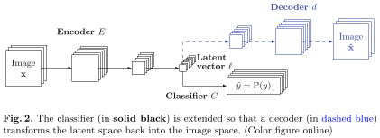
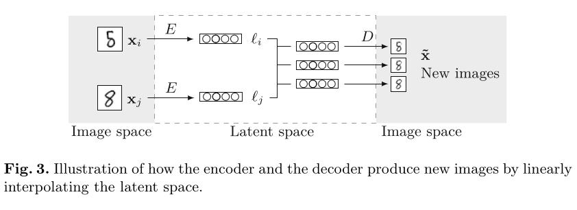

# Active Supervision
**Active supervision** allows the user to refine the decision boundary of a model by generating intermediate examples of an image and the other classes.

Important notes: `train1.py` trains the classifier and decoder (student and teacher), `train2.py` then uses the teacher to improve the student using the aforementioned technique. In the experiments we end up not using a human due to the time involved; instead, we use a bigger network trained on the entire dataset as a proxy for the human.

Published paper:
* R. Cruz, A. Shihavuddin, M. Maruf, J. Cardoso, "[Active Supervision: Human in the Loop](https://doi.org/10.1007/978-3-031-49018-7_38)", Iberoamerican Congress on Pattern Recognition 2023 (CIARP)	
Related paper:
* P. Serrano e Silva, R. Cruz, A. Shihavuddin, T. Gonçalves, "[Interpretability-Guided Human Feedback During Neural Network Training](https://doi.org/10.1007/978-3-031-36616-1_22)", Iberian Conference on Pattern Recognition and Image Analysis 2023 (IbPRIA)
    * In this related paper, we use xAI techniques to ask the human if the model is looking at regions that make sense for the decision. If not, we penalize the model.
